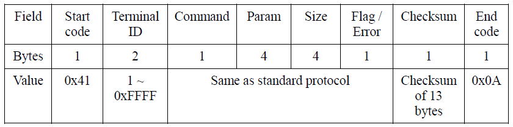

#UF Protocol Manual  


###Packet Protocol

In the packet protocol of UniFinger, 1 packet is `13 bytes` long and its structure is as follows.

| Start code | Command | Param  |  Size  | Flag/Error | Checksum | End code |
| :--------: | :-----: | :----: | :----: | :--------: | :------: | :------: |
|   1byte    |  1byte  | 4bytes | 4bytes |   1byte    |  1byte   |  1byte   |

1. `Start code`: 1 byte. Indicates the beginning of a packet. It always should be 0x40.  
2. `Command`: 1 byte. Refer to the "Command Summary" on page 66.  
3. `Param`: 4 bytes. Indicates user ID or system parameters.  
4. `Size`: 4 bytes. Indicates the size of binary data following the command packet such as fingerprint templates or images.  
5. `Flag/Error`: 1 byte. Indicates flag data in the request command sent to the module, and error code in the response command received from the module, respectively.  
6. `Checksum`: 1 byte. Checks the validity of a packet. Checksum is a remainder of the sum of each field, from the Start code to Flag/Error, divided by 256 (0x100).  
7. `End code`: 1 byte. Indicates the end of a packet. It always should be 0x0A. It is also used as a code indicating the end of a binary data such as fingerprint templates.  

---

- The packet transmitted between the host and the module has the same structures. The commands transmitting from the host to the module are called `request command`, and the response transmitting from the module to the hosts, `response command`.  
- In general, the host receives one response command for one request command. However, it may receive two response commands for some commands such as Enroll by Scan. The first command comes in the intermediate stage, notifying image scanning completed and the other command notifies process result. If you do not want to receive the intermediate command, you can disable it by changing a system parameter.  
- The fingerprint templates vary in size by sensor and firmware version.  
- In the following document, `#` indicates numbers and the `number of #` specifies the number of digits. `N/A` indicates that any value can be applied to the field and `Null` indicates 0x00.  
- In the transmission of actual data, the byte order is little endian, the lowest byte is transmitted first. For instance, when transmitting data of 400 (0x190) in the Size field, which is 4 bytes long, the data transmission order is as follows: 0x90, 0x01, 0x00, 0x00. The rule also holds for the data received from the module.  
- Take `ES` command (0x05) as an example, the following is the data transmission order and computation of the checksum of the command:
When enrolling a new fingerprint with an ID,‘0x9929’:  

| Start code | Command | Param  | Size  | Flag/Error | Checksum | End code |
| :--------: | :-----: | :----: | :---: | :--------: | :------: | :------: |
|    0x40    |  0x05   | 0x9929 | 0x00  |    0x00    |   0x07   |   0x0A   |

Actual values input in the Param:

| 1^st^place | 2^nd^ place | 3^rd^ place | 4^th^ place |
| :--------: | :---------: | :---------: | :---------: |
|    0x29    |    0x99     |    0x00     |    0x00     |

Byte transmission order:

0x40, 0x05, 0x29, 0x99, 0x00, 0x00, 0x00, 0x00, 0x00, 0x00, 0x00, 0x07, 0x0A

To compute the checksum, first compute the sum of each byte of the packet (from start code to flag/error) as demonstrated below:  
```
0x40 + 0x05 + 0x29 + 0x99 + 0x00 + 0x00 + 0x00 + 0x00 + 0x00 + 0x00 = 0x107
```
Divide the above value by 0x100(256). The remainder of this division is 0x07 and this value is the checksum.

---

### Network Packet Protocol

In order to support RS422 or RS485 network interfaces, UniFinger modules support network packet protocols. Network packet is composed of `15 bytes`, whose start code is different from the standard packet, and includes 2 bytes for terminal ID. The terminal ID is correspondent to the lower 2 bytes of Module ID of system parameter.



The contents of the network packet, including command, param, size, and flag are same as those of standard packet. Checksum field is the checksum value of preceding 13 bytes.  
Until firmware V1.3, SFM3000/3500 modules respond both standard and network packets regardless of Network Mode system parameter. However, since firmware V1.4, the modules only respond to 15 byte network packets if Network Mode system parameter is on. See Network Mode system parameter for details.

---

### Broadcast Packet Protocol

In RS422 or RS485 network environments, a host can send broadcast packets to all the modules in the network. The only difference between network packets and broadcast packets is that the Terminal ID field of the latter should be 0x00.


All the modules in the network process the broadcast packet, but do not send response packet to prevent packet collisions. Therefore, if the host wants to confirm that the broadcast request is handled correctly, it should send another request packet to each module using Network Packet Protocol. There is only one exception to this rule. See ID command for details.  
Broadcast Packet Protocol is provided for SFM3000/3500/4000/5000/5500/6020/6030/6050 series only. The 13 byte broadcast packet protocol introduced in V1.3 firmware is not supported any longer.  
Three types of packet protocol can be summarized as follows:  


### System Parameter Summary

|             Name             | Code  |                                                 Description                                                 |                                                                                                                                                                                                                                                           Value (*denotes default value)                                                                                                                                                                                                                                                           |
| :--------------------------: | :---: | :---------------------------------------------------------------------------------------------------------: | :------------------------------------------------------------------------------------------------------------------------------------------------------------------------------------------------------------------------------------------------------------------------------------------------------------------------------------------------------------------------------------------------------------------------------------------------------------------------------------------------------------------------------------------------- |
|           Timeout            | 0x62  |                                               Timeout period                                                | 0x30 : infinite <br> 0x31 : 1 second <br> ... <br> *0x3A : 10 seconds <br> ... <br> 0x44 : 20 seconds                                                                                                                                                                                                                                                                                                                                                                                                                                              |
|      Template Size [^1]      | 0x64  |                Template size. When the Encryption Mode is on, it should be a multiple of 32.                | Integer between 256 and *384[^4]                                                                                                                                                                                                                                                                                                                                                                                                                                                                                                                   |
|         Enroll Mode          | 0x65  |                                                 Enroll mode                                                 | 0x30 : 1 time <br> 0x31 : 2 times ( 1 request command & 2 response commands ) <br> 0x32 : 2 times II ( 2 request commands & 2 response commands ) <br> *0x41 : 2 templates ( 1 request command & 2 response commands ) [^1] <br> 0x42 : 2 templates II ( 2 request commands & 2 response commands ) [^1] <br>                                                                                                                                                                                                                                      |
|        Security Level        | 0x66  |                                               Security Level                                                | 0x30 : 1/10 FAR( False Acceptance Rate ) [^1][^5] <br> 0x31 : 1/100(5) <br>  0x32 : 1/1,000(5) <br> 0x33 : 1/10,000 <br> 0x34 : 1/100,000 <br> 0x35 : 1/1,000,000 <br> 0x36 : 1/10,000,000 [^1] <br> 0x37 : 1/100,000,000 [^1] <br> 0x40 : 3/100 [^1][^5] <br> 0x41 : 3/1,000 [^1][^5] <br> 0x42 : 3/10,000 [^1][^5] <br> 0x43 : 3/100,000 [^1] <br> 0x44 : 3/1,000,000 [^1] <br> 0x45 : 3/10,000,000 [^1] <br> 0x46 : 3/100,000,000 [^1] <br> *0x50 : Automatic Normal[^1] <br> 0x51 : Automatic Secure[^1] <br> 0x52 : Automatic More Secure[^1] |
|       Encryption Mode        | 0x67  |                                               Encryption mode                                               | *0x30 : Encryption off <br> 0x31 : Encryption on                                                                                                                                                                                                                                                                                                                                                                                                                                                                                                   |
|         Sensor Type          | 0x68  |                                                 Sensor Type                                                 | 0x31: FC <br> 0x33 : OP / OP2 / OP3 / OP4 / OP5 <br> 0x34 : TC1 / TC2 / TC1S / TC2S <br> 0x38 : OC2 / OD/ OC4 / OH <br> 0x39 : OL <br> 0x3C: TS4                                                                                                                                                                                                                                                                                                                                                                                                   |
|         Image Format         | 0x6C  |                                                Image format                                                 | 0x30 : Gray image <br> *0x31 : Binary image <br> 0x32 : 4 bit gray image <br> 0x33 : WSQ image[^9]                                                                                                                                                                                                                                                                                                                                                                                                                                                 |
|          Module ID           | 0x6D  |                                                  Module ID                                                  | Integer 0 ~ 65535                                                                                                                                                                                                                                                                                                                                                                                                                                                                                                                                  |
|       Firmware Version       | 0x6E  |                                              Firmware version                                               | 4bytes character                                                                                                                                                                                                                                                                                                                                                                                                                                                                                                                                   |
|        Serial Number         | 0x6F  |                                                Serial number                                                | Integer (4bytes)                                                                                                                                                                                                                                                                                                                                                                                                                                                                                                                                   |
|           Baudrate           | 0x71  |                                            Host baudrate setting                                            | 0x31 : 9600 bps <br> 0x32 : 19200 bps <br> 0x33 : 38400 bps <br> 0x34 : 57600 bps <br> *0x35 : 115200 bps <br> 0x36 : 230400 bps <br> 0x37 : 460800 bps <br> 0x38 : 921600 bps                                                                                                                                                                                                                                                                                                                                                                     |
|        Baudrate2[^2]         | 0x72  |                                         Auxiliary baudrate setting                                          | 0x31 : 9600 bps <br> 0x32 : 19200 bps <br> 0x33 : 38400 bps <br> 0x34 : 57600 bps <br> *0x35 : 115200 bps                                                                                                                                                                                                                                                                                                                                                                                                                                          |
|       Enrolled Finger        | 0x73  |                                   Current number of fingerprints enrolled                                   | Integer (4bytes)                                                                                                                                                                                                                                                                                                                                                                                                                                                                                                                                   |
|       Available Finger       | 0x74  |                          The available number of fingerprints that can be enrolled                          | Integer (4bytes)                                                                                                                                                                                                                                                                                                                                                                                                                                                                                                                                   |
|      Send Scan Success       | 0x75  |                                    Enable sending SCAN_SUCCESS response                                     | 0x30 : No SCAN_SUCCESS message <br> *0x31 : Send SCAN_SUCCESS message                                                                                                                                                                                                                                                                                                                                                                                                                                                                              |
|         ASCII Packet         | 0x76  |                              Flag for packet exchange though HEX-ASCII format                               | *0x30 : Hexadecimal packet <br> 0x31 : ASCII packet                                                                                                                                                                                                                                                                                                                                                                                                                                                                                                |
|         Rotate Image         | 0x77  |                                  Flag for rotating sensor image in capture                                  | *0x30 : Upright image <br> 0x31 : Upside down image                                                                                                                                                                                                                                                                                                                                                                                                                                                                                                |
|         Rotation[^1]         | 0x78  |                                   Maximum allowable rotation for matching                                   | 0x31: 15 degree <br> * 0x32: 30 degree <br> 0x33: 45 degree <br> 0x34: 60 degree <br> 0x35: 75 degree <br> 0x36: 90 degree                                                                                                                                                                                                                                                                                                                                                                                                                         |
|         Sensitivity          | 0x80  |                                      Parameter for sensor sensitivity                                       | 0x30 : Least sensitive <br> … <br> *0x37 : Most sensitive                                                                                                                                                                                                                                                                                                                                                                                                                                                                                          |
|        Image Quality         | 0x81  |                                   Parameter for qualifying scanned image                                    | 0x30 : Weak qualification <br> *0x31 : Moderate qualification <br> 0x32 : Strong qualification <br> 0x33 : Strongest qualification                                                                                                                                                                                                                                                                                                                                                                                                                 |
|        Auto Response         | 0x82  |                 Flag for sending automatic response as the result of GPIO input or FreeScan                 | *0x30 : No response command <br> 0x31 : Send response command ( host ) <br> 0x32 : Send response command ( aux ) [^2] <br> 0x33 : Send response command ( both ) [^2]                                                                                                                                                                                                                                                                                                                                                                              |
|         Network Mode         | 0x83  |                                       Flag for default operation mode                                       | *0x30 : Single mode <br> 0x31 : Network mode ( half duplex ) <br> 0x32 : Network mode ( full duplex )[^2]                                                                                                                                                                                                                                                                                                                                                                                                                                          |
|          Free Scan           | 0x84  |                       Scan always fingerprint images for identification on idle state                       | *0x30 : Normal mode <br> 0x31 : Free scan mode                                                                                                                                                                                                                                                                                                                                                                                                                                                                                                     |
|      Provisional Enroll      | 0x85  |                         Save enrolled templates at flash memory permanently or not                          | *0x30 : Permanent enrollment <br> 0x31 : Provisional enrollment                                                                                                                                                                                                                                                                                                                                                                                                                                                                                    |
|       Pass When Empty        | 0x86  |                                  Pass or fail when fingerprint DB is empty                                  | *0x30 : Fail when DB is empty <br> 0x31 : Pass when DB is empty                                                                                                                                                                                                                                                                                                                                                                                                                                                                                    |
|        Response Delay        | 0x87  |                                         Delay for response command                                          | *0x30 : No delay <br> 0x31 : 20 msec <br> … <br> 0x35 : 100 msec <br> … <br> 0x3A : 200 msec                                                                                                                                                                                                                                                                                                                                                                                                                                                       |
|       Matching Timeout       | 0x88  |                                Timeout period for matching in identification                                | 0x30 : infinite <br> 0x31 : 1 second <br> … <br> *0x33: 3 seconds <br> … <br> 0x3A : 10 seconds <br> … <br> 0x44 : 20 seconds                                                                                                                                                                                                                                                                                                                                                                                                                      |
|         Build Number         | 0x89  |                                                Build number                                                 | 4bytes character                                                                                                                                                                                                                                                                                                                                                                                                                                                                                                                                   |
|   Enroll Displacement[^3]    | 0x8A  | Displacement between two fingerprints for enrollment in case EnrollMode parameter is 2 times or 2 templates | *0x30 : No check <br> 0x31 : Above 1 mm away <br> … <br> 0x35 : Above 5 mm away <br> … <br> 0x3A : Above 10 mm away                                                                                                                                                                                                                                                                                                                                                                                                                                |
|    Lighting Condition[^1]    | 0x90  |                              Tune optical sensors based on lighting conditions                              | *0x30: Outdoor <br> 0x31: Indoor<br>                                                                                                                                                                                                                                                                                                                                                                                                                                                                                                               |
|     Free Scan Delay[^1]      | 0x91  |                    Delay between consecutive identification processes in Free Scan Mode.                    | 0x30: No delay <br> *0x31: 1 second <br> … <br>0x40: 10 seconds                                                                                                                                                                                                                                                                                                                                                                                                                                                                                    |
|        Fast Mode[^1]         | 0x93  |                                         Fast mode for 1:N matching                                          | 0x30: Normal <br> 0x31: Fast mode 1 <br> … <br> 0x35: Fast mode 5(Fastest) <br> *0x36: Automatic                                                                                                                                                                                                                                                                                                                                                                                                                                                   |
|         Watchdog[^1]         | 0x94  |                                               Watchdog timer                                                | 0x30: Don’t use Watchdog timer <br> *0x31: Use Watchdog timer                                                                                                                                                                                                                                                                                                                                                                                                                                                                                      |
|      Template Type[^1]       | 0x96  |                                                Template type                                                | *0x30: Suprema <br> 0x31: ISO 19794-2 <br> 0x32: ANSI 378                                                                                                                                                                                                                                                                                                                                                                                                                                                                                          |
|     Enhanced Privacy[^1]     | 0x97  |                                            Enhanced privacy mode                                            | *0x30: Enhanced mode off <br> 0x31: Enhanced mode on                                                                                                                                                                                                                                                                                                                                                                                                                                                                                               |
|  Fake Finger Detection[^1]   | 0x98  |                                        Fake finger detection option                                         | *0x30: Fake detection off <br> 0x31: Fake detection on ( Weak[^8]) <br> 0x32: Normal[^8] <br> 0x33: Strong[^8]                                                                                                                                                                                                                                                                                                                                                                                                                                     |
| Check Latent Fingerprint[^6] | 0x9A  |                                     Latent fingerprint detection option                                     | *0x30: Don’t check latent fingerprints when enrolling <br> 0x31: Don’t check latent fingerprints <br> 0x32: Check latent fingerprints always                                                                                                                                                                                                                                                                                                                                                                                                       |
|     Voltage Warning[^7]      | 0x9B  |                                          Voltage warning threshold                                          | *0: Don’t check voltage <br> 1 ~ 12000: Threshold voltage in mV                                                                                                                                                                                                                                                                                                                                                                                                                                                                                    |
|           PowerOff           | 0x9C  |                                       Timeout for automatic power off                                       | *0: No timeout                                                                                                                                                                                                                                                                                                                                                                                                                                                                                                                                     |


---

### Command Summary

|            Category            | Name  | Code  |                    Description                    | 3000 / 4000 / 5000 | 3500 / 5500 | 6000  |
| :----------------------------: | :---: | :---: | :-----------------------------------------------: | :----------------: | :---------: | :---: |
|      System Configuration      |  SW   | 0x01  |              Write system parameter               |         O          |      O      |   O   |
|                                |  SF   | 0x02  |               Save system parameter               |         O          |      O      |   O   |
|                                |  SR   | 0x03  |               Read system parameter               |         O          |      O      |   O   |
|                                |  CS   | 0x1A  |                 Calibrate sensor                  |         O          |      O      |   O   |
|                                |  SS   | 0x04  |                Check system status                |         O          |      O      |   O   |
|                                |  CA   | 0x60  |                      Cancel                       |         O          |      O      |   O   |
|                                |  ID   | 0x85  |                 Get the module ID                 |         O          |      O      |   O   |
|                                |  UG   | 0x62  |                 Upgrade firmware                  |         O          |      O      |   O   |
|                                |  RS   | 0xD0  |                 Reset the module                  |         O          |      O      |   O   |
|                                |  LM   | 0xB1  |                  Lock the module                  |         X          |      O      |   X   |
|                                |  UM   | 0xB0  |                 Unlock the module                 |         X          |      O      |   X   |
|                                |  MP   | 0xB2  |            Change the master password             |         X          |      O      |   X   |
|                                |  OFF  | 0xD2  |                Turn off the module                |       O[^7]        |      X      |   X   |
|             Enroll             |  ES   | 0x05  |                  Enroll by scan                   |         O          |      O      |   O   |
|                                |  ESA  | 0x70  |       ES with administrator’s verification        |         O          |      O      |   O   |
|                                |  EI   | 0x06  |                  Enroll by image                  |         O          |      O      |   O   |
|                                |  EIX  | 0x80  |      EI with extended data transfer protocol      |         O          |      O      |   O   |
|                                |  ET   | 0x07  |                Enroll by template                 |         O          |      O      |   O   |
|                                |  ETX  | 0x87  |      ET with extended data transfer protocol      |         O          |      O      |   O   |
|                                |  EW   | 0x1C  |               Enroll by Wiegand ID                |         X          |      O      |   X   |
|                                |  EWA  | 0x71  |       EW with administrator’s verification        |         X          |      O      |   X   |
|             Verify             |  VS   | 0x08  |                  Verify by scan                   |         O          |      O      |   O   |
|                                |  VI   | 0x09  |                  Verify by image                  |         O          |      O      |   O   |
|                                |  VIX  | 0x82  |      VI with extended data transfer protocol      |         O          |      O      |   O   |
|                                |  VT   | 0x10  |                Verify by template                 |         O          |      O      |   O   |
|                                |  VW   | 0x1D  |               Verify by Wiegand ID                |         X          |      O      |   X   |
|                                |  VH   | 0x22  |           Verify host template by scan            |         O          |      O      |   O   |
|                                |  WSL  | 0x6B  |          Write security level of a user           |         O          |      O      |   O   |
|                                |  RSL  | 0x6C  |           Read security level of a user           |         O          |      O      |   O   |
|            Identify            |  IS   | 0x11  |                 Identify by scan                  |         O          |      O      |   O   |
|                                |  II   | 0x12  |                 Identify by image                 |         O          |      O      |   O   |
|                                |  IIX  | 0x81  |      II with extended data transfer protocol      |         O          |      O      |   O   |
|                                |  IT   | 0x13  |               Identify by template                |         O          |      O      |   O   |
|             Delete             |  DA   | 0x17  |               Delete all templates                |         O          |      O      |   O   |
|                                |  DAA  | 0x74  |       DA with administrator’s verification        |         O          |      O      |   O   |
|                                |  DT   | 0x16  |                  Delete template                  |         O          |      O      |   O   |
|                                |  DS   | 0x1E  |                  Delete by scan                   |         O          |      O      |   O   |
|                                |  DSA  | 0x72  |       DS with administrator’s verification        |         O          |      O      |   O   |
|                                |  DW   | 0x1F  |               Delete by Wiegand ID                |         X          |      O      |   X   |
|                                |  DWA  | 0x73  |       DW with administrator’s verification        |         X          |      O      |   X   |
|      Template management       |  LT   | 0x18  |                   List user ID                    |         O          |      O      |   O   |
|                                |  LTX  | 0x86  | List user ID with extended data transfer protocol |         O          |      O      |   O   |
|                                |  CT   | 0x19  |                   Check user ID                   |         O          |      O      |   O   |
|                                |  FP   | 0x23  |           Fix all provisional templates           |         O          |      O      |   O   |
|                                |  DP   | 0x24  |         Delete all provisional templates          |         O          |      O      |   O   |
|     Get image and template     |  RI   | 0x20  |                    Read image                     |         O          |      O      |   O   |
|                                |  RIX  | 0x84  |      RI with extended data transfer protocol      |         O          |      O      |   O   |
|                                |  SI   | 0x15  |                    Scan image                     |         O          |      O      |   O   |
|                                |  SIX  | 0x83  |      SI with extended data transfer protocol      |         O          |      O      |   O   |
|                                |  RT   | 0x14  |                   Read template                   |         O          |      O      |   O   |
|                                |  RTX  | 0x89  |      RT with extended data transfer protocol      |         O          |      O      |   O   |
|                                |  ST   | 0x21  |                   Scan template                   |         O          |      O      |   O   |
|                                |  KS   | 0x35  |         Scan template with challenge data         |         O          |      O      |   O   |
|                                |  KW   | 0x34  |               Write encryption key                |         O          |      O      |   O   |
|     User memory management     |  ML   | 0x31  |              Get size of user memory              |         O          |      O      |   O   |
|                                |  MW   | 0x32  |               Write to user memory                |         O          |      O      |   O   |
|                                |  MR   | 0x33  |               Read from user memory               |         O          |      O      |   O   |
|    Time and log management     |  TW   | 0x3A  |                Write current time                 |         X          |      O      |   X   |
|                                |  TR   | 0x3B  |                 Read current time                 |         X          |      O      |   X   |
|                                |  LN   | 0x3C  |              Get number of log data               |         X          |      O      |   X   |
|                                |  LR   | 0x3D  |                   Read log data                   |         X          |      O      |   X   |
|                                |  LD   | 0x3E  |                  Delete log data                  |         X          |      O      |   X   |
|                                |  LC   | 0x3F  |          Set / Get the custom log field           |         X          |      O      |   X   |
|                                |  RCL  | 0xEC  |                  Read log cache                   |         X          |      O      |   X   |
|                                |  CCL  | 0xEB  |                  Clear log cache                  |         X          |      O      |   X   |
|     Wiegand configuration      |  WW   | 0x41  |            Write Wiegand configuration            |         X          |      O      |   X   |
|                                |  WR   | 0x42  |            Read Wiegand configuration             |         X          |      O      |   X   |
|                                |  WG   | 0x43  |                 Get Wiegand input                 |         X          |      O      |   X   |
|                                |  WS   | 0x44  |                Set Wiegand output                 |         X          |      O      |   X   |
|                                |  WM   | 0x68  |         Map Wiegand ID to input function          |         X          |      O      |   X   |
|                                |  WL   | 0x69  |              List Wiegand ID mapping              |         X          |      O      |   X   |
|                                |  WC   | 0x6A  |             Clear Wiegand ID mapping              |         X          |      O      |   X   |
| Extended Wiegand configuration |  WWX  | 0xC0  |            Write Wiegand configuration            |         X          |      O      |   X   |
|                                |  WRX  | 0xC1  |            Read Wiegand configuration             |         X          |      O      |   X   |
|                                |  WGX  | 0xC2  |                 Get Wiegand input                 |         X          |      O      |   X   |
|                                |  WSX  | 0xC3  |                Set Wiegand output                 |         X          |      O      |   X   |
|                                |  WFW  | 0xC4  |         Set alternative value of a field          |         X          |      O      |   X   |
|                                |  WFR  | 0xC5  |         Get alternative value of a filed          |         X          |      O      |   X   |
|                                |  WPW  | 0xC6  |            Write Wiegand I/O settings             |         X          |      O      |   X   |
|                                |  WPR  | 0xC7  |             Read Wiegand I/O settings             |         X          |      O      |   X   |
|      Input configuration       |  IW   | 0x47  |             Write input configuration             |         X          |      O      |   X   |
|                                |  IR   | 0x48  |             Read input configuration              |         X          |      O      |   X   |
|                                |  IG   | 0x49  |                  Get input state                  |         X          |      O      |   X   |
|      Output configuration      |  OW   | 0x4A  |            Write output configuration             |         X          |      O      |   X   |
|                                |  OR   | 0x4B  |             Read output configuration             |         X          |      O      |   X   |
|                                |  OL   | 0x4C  |          Read output configuration list           |         X          |      O      |   X   |
|                                |  OS   | 0x4D  |                 Set output state                  |         X          |      O      |   X   |
|       GPIO configuration       |  GW   | 0x37  |             Write GPIO configuration              |         O          |      X      |   O   |
|                                |  GR   | 0x36  |              Read GPIO configuration              |         O          |      X      |   O   |
|                                |  GC   | 0x38  |             Clear GPIO configuration              |         O          |      X      |   O   |
|                                |  GD   | 0x39  |          Set default GPIO configuration           |         O          |      X      |   O   |
|   Admin level configuration    |  AW   | 0x65  |            Write administration level             |         O          |      O      |   O   |
|                                |  AR   | 0x66  |             Read administration level             |         O          |      O      |   O   |
|                                |  AC   | 0x67  |            Clear administration level             |         O          |      O      |   O   |
|    Auth. mode configuration    |  UW   | 0xA3  |             Write authentication mode             |         X          |      O      |   X   |
|                                |  UR   | 0xA4  |             Read authentication mode              |         X          |      O      |   X   |
|                                |  UC   | 0xA5  |       Reset authentication mode to default        |         X          |      O      |   X   |
|                                |  UL   | 0xA6  |   List user IDs grouped by authentication mode    |         X          |      O      |   X   |
|    Blacklist configuration     |  ABL  | 0xF3  |              Add an ID to blacklist               |         X          |      O      |   X   |
|                                |  DBL  | 0xF4  |            Delete an ID from blacklist            |         X          |      O      |   X   |
|                                |  RBL  | 0xF5  |                  Read blacklist                   |         X          |      O      |   X   |
|                                |  CBL  | 0xF6  |                  Clear blacklist                  |         X          |      O      |   X   |
|  Entrance limit configuration  |  WME  | 0xF0  |               Write entrance limit                |         X          |      O      |   X   |
|                                |  RME  | 0xF1  |                Read entrance limit                |         X          |      O      |   X   |
|                                |  CME  | 0xF2  |               Clear entrance limit                |         X          |      O      |   X   |
|        System Parameter        |  FR   | 0xFA  |     Factory reset by erasing system parameter     |         X          |      X      |   O   |
|          File System           |  FF   | 0xFF  |            Raw format userdb partition            |         X          |      X      |   O   |


!!!note "Contact us"
    If you need more detail information about this documents (UF_Protocol_Manual), please contact at sales_sol@suprema.co.kr


[^1]:SFM3000/3500/4000/5000 only
[^2]:SFM3500 only
[^3]:SFM3000/3500/4000/5000 only
[^4]:Reducing template size might affect authentication performance.
[^5]:Since firmware V1.3, the minimum security level of SFM3000/3500 series is changed to 1/10,000.
[^6]:SFM3020-OP, SFM3520-OP, SFM4020-OP, SFM5020-OP only
[^7]:SFM4000 only
[^8]:SFM5060-OH only
[^9]:SFM5500 only
[^10]:SFM60x0 only
